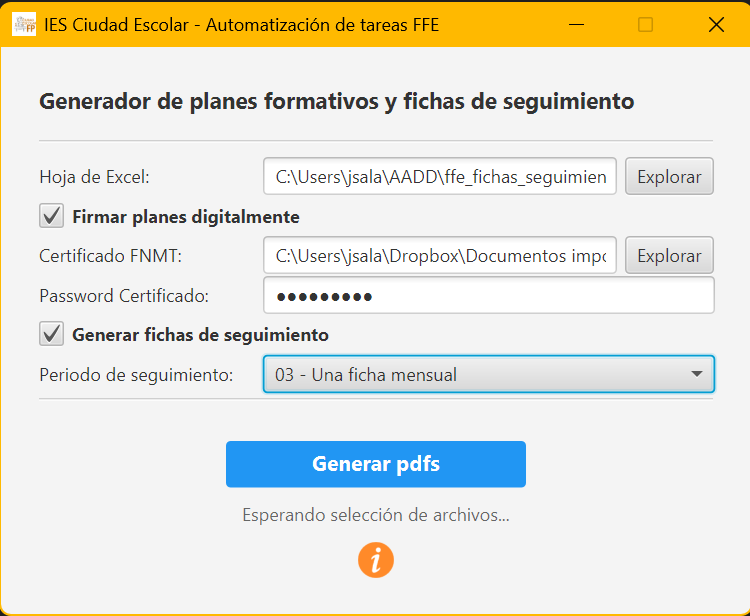

# 📝 Automatización FFE - Planes de formación y Fichas de seguimiento 

👨‍🏫 IES: Ciudad Escolar

📥 Depto: Informática y Comunicaciones

🧑‍💻 Profesor: José Sala Gutiérrez

---

## Descripción del proyecto

El objetivo de este proyecto no es otro que facilitar el trabajo burocrático de los docentes tutores de prácticas de FFE (Fase de Formación en Empresa) de los ciclos formativos de FP en centros de la Comunidad de Madrid.

En la nueva versión de este proyecto, se automatiza la creación tanto de **los planes formativos** como **las fichas de seguimiento** usando la plantilla publicada en la Comunidad de Madrid y un fichero Excel:

- `datos_ffe_plan_de_formacion.xlsx`: fichero excel con dos tabs. El primero con los atributos comunes de todos los planes para un determinado ciclo y el segundo con los registros de cada alumno.
- `anexo_plan_de_formacion_editable.pdf`: plantilla propia de la Comunidad de Madrid (marzo 2026).
- `anexo_ficha_seguimiento_editable.pdf`: plantilla propia de la Comunidad de Madrid (marzo 2026).

Al finalizar la ejecución, dependiendo de las opciones seleccionadas por el docente, se habrán creado:

1. Un plan formativo por cada alumno usando la nombreclatura solicitada por jefatura de estudios para subir los ficheros al formulario:

    ```text
        Apellido1Alumno_Apellido2Alumno_CodigoCiclo.pdf
        Apellido1Alumno_CodigoCiclo.pdf (alumnos con un único apellido)
    ```

2. Una ficha de seguimiento por cada periodo y alumno.

    ```text
        Apellido1Alumno_Apellido2Alumno_CodigoCiclo_Periodo.pdf
        Apellido1Alumno_CodigoCiclo_Periodo.pdf (alumnos con un único apellido)
    ```

## Interfaz gráfica

La nueva versión `v.5.0.0` mantiene la funcionalidad del proyecto pero añade la generación de fichas formativas para facilitar su uso a los docentes.



## Releases

Para facilitar la distribución de la herramienta se ha generado una release con todo lo necesario para poder ejecutarlo. La puedes encontrar en la sección  `releases` dentro de este repositorio de GitHub como un fichero ZIP.

## Manual de instrucciones

Para poder utilizar esta herramienta, sigue los siguientes pasos:

1) Descarga la release publicada

2) Descomprime el fichero en tu directorio personal de trabajo (ej. C:\Users\xxx)

3) Modifica el fichero `datos_ffe_plan_de_formacion.xlsx` incluido en el directorio comprimido añadiendo los registros con los datos de cada alumno que vaya a realizar la FFE y también modificando los datos comunes de acuerdo al IES, Ciclo, Módulos evaluados, RAs involucrados, tutor docente...

4) Selecciona el fichero excel modificado en el paso anterior

5) **Paso opcional no bloqueante**: Si se quieren firmar los planes formativos generados usando la firma de FNMT:
   1) Se debe activar el checkbox "Firmar documentos digitalmente"
   2) Seleccionar el certificado personal de FNMT con extensión .p12.
   3) Indicar la contraseña de la clave privada de dicho certificado

6) **Paso 2 opcional no bloqueante**: Si el docente quiere generar las fichas de seguimiento de los alumnos de acuerdo al periodo que considere:
   1) Se debe activar el checkbox "Generar fichas seguimiento"
   2) Seleccionar el periodo de seguimiento (una ficha única, una ficha semanal o una ficha mensual).

7) Haz click sobre el botón de `Generar pdfs`

8) Revisa que todos los planes y fichas se han generado y que el contenido se ajusta a lo esperado.

   - Los pdfs de planes sin firmar estarán en una carpeta `<codigo_ciclo>_planes_sin_firmar` y los firmados en `<codigo_ciclo>_planes_firmados`.
   - Los pdfs de fichas estarán en una carpeta `<codigo_ciclo>_fichas_seguimiento`.

9) Si hubiera algun error, actualiza de nuevo el fichero Excel y re-ejecuta la aplicación. Los planes y fichas generados se sobreescriben.

## Tecnologías utilizadas

- Maven + Java 21 (LTS)
- slf4j + Logback
- itextpdf
- jpackage + signtool
- java security + bouncycastle
- apache poi
- JavaFX

## Bug fixing

- Adaptación de los ficheros de entrada:
- Se eliminan los nombres de los pié de firmas
- Se añade email de empresa
- De acuerdo a jefatura de estudios (11/02/26), el periodo de FFEs en 2º será siempre `periodo número 2`

## Versiones

- v1.0.1: Permite generar los planes de formación con el formato antiguo a partir de dos ficheros txt.
- v2.0.1: Permite generar los planes de formación con el formato nuevo y posteriormente firmarlos a partir de dos ficheros txt.
- v3.0.0: Permite generar los planes de formación con el formato nuevo y posteriormente firmarlos a partir de un fichero excel.
- v4.0.0: Se añade interfaz gráfica para facilitar su uso por parte de los docentes.
- v5.0.0: Se añade la funcionalidad de generar las fichas de seguimiento.
